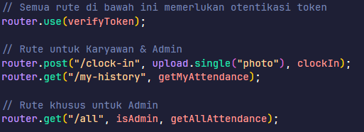

# 🗓️ Attendance Service



Attendance Service adalah bagian dari **arsitektur microservices** untuk aplikasi **Absensi WFH**.  
Service ini berfungsi untuk mengelola seluruh data absensi karyawan, termasuk:

- Menerima & menyimpan data absensi (clock-in) beserta bukti foto  
- Menyediakan riwayat absensi untuk masing-masing karyawan  
- Memungkinkan admin melihat data absensi secara keseluruhan
- Memungkinkan admin mengelola data karyawan

---

## 🚀 Teknologi yang Digunakan

- **Node.js** – Runtime JavaScript
- **Express.js** – Framework REST API
- **Prisma** – ORM untuk interaksi database
- **MySQL** – Database relasional
- **JWT** – Autentikasi & verifikasi token user
- **Multer** – Middleware untuk upload foto absensi

---

## ⚙️ Cara Install & Jalankan

### 1. Clone Repository

```bash
git clone https://github.com/ihsanmarseno/attendance-service.git
cd /attendance-service
```

### 2. Install Dependencies

```bash
npm install
```

### 3. Setup Environment Variables

```bash
DATABASE_URL="mysql://root:@localhost:3306/attendance-service"
JWT_SECRET="JWTSECRETDUMMY"
PORT=5002
```

### 4. Running Migrasi Prisma

```bash
npx prisma migrate dev
```

### 5. Generate Prisma Client

```bash
npx prisma generate
```

### 6. Running Server

- Mode Development

```bash
npm run dev
```

- Mode Production

```bash
npm run start
```
